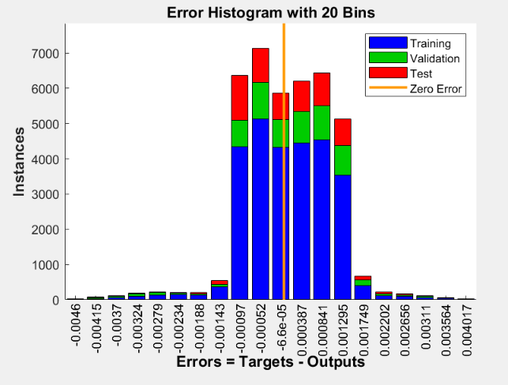
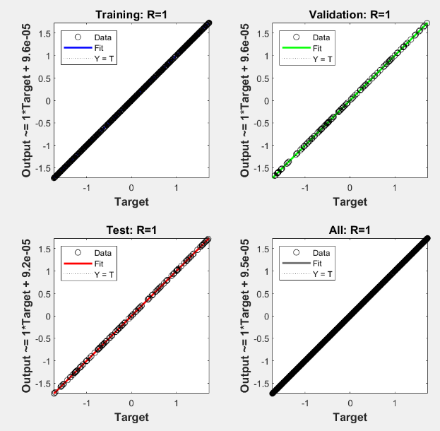
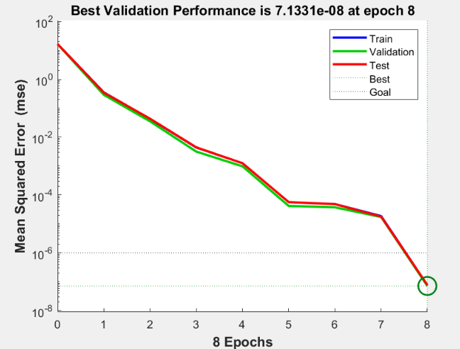
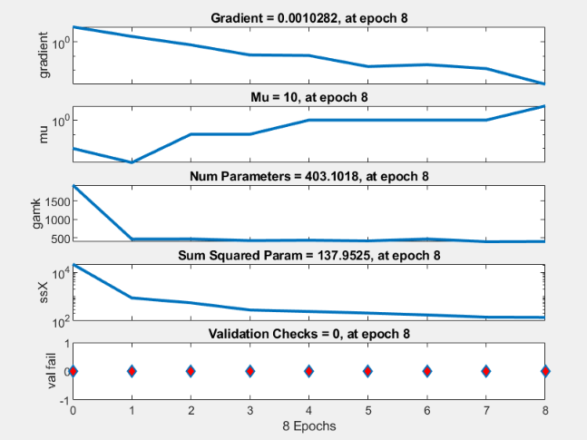
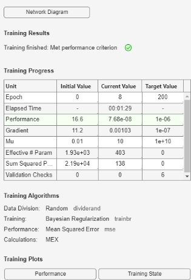

## Current Progress

I have completed a second code which proves as a proof of concept for the main data when it arrives. I have an input of sea 'clutter' returns to be able to predict the refractivity profile with respect to height of a propagating radar wave.

### Code
For this project, I used MATLAB to generate synthetic sea 'clutter' return data and develop a neural network model to predict the refractivity profile. The data was designed to capture a proof of concept, ensuring a diverse range of features for robust model training. This approach allows for the simulation of real-world sea clutter conditions while maintaining full control over data properties.

Initially, I considered using the Levenberg-Marquardt (LM) backpropagation algorithm for training. However, after evaluation, I opted for Bayesian Regularization (BR) as it proved to be a better fit for this specific application. Bayesian Regularization helps prevent overfitting by incorporating a probabilistic framework that adjusts the network's complexity during training. Unlike LM, which focuses on minimizing the sum of squared errors, BR modifies the objective function by adding a penalty term that reduces excessive model complexity, making it particularly effective when dealing with noisy or limited datasets.

Since sea clutter data can exhibit high variability and may contain noise, Bayesian Regularization allowed for improved generalization, ensuring the model performs well on unseen data while maintaining stability.

The code for this project is available in the following repository:

[Link to code](./Code/Neural_Net2.m/)

You're welcome to explore, contribute, or share your feedback! The code is structured into distinct modules for data preprocessing, model training, and evaluation, ensuring clarity and ease of navigation.

### Figures

I used multiple figures to visualize how well the neural network model aligns with the actual values in the dataset. The performance metrics demonstrate a strong correlation between predictions and real data, showcasing the model’s ability to capture complex atmospheric relationships accurately.

  

<em>Figure 1: This shows the plot from my neural network model, demonstrating minimal error against the targets.</em>

The error histogram illustrates the neural network model’s prediction accuracy by depicting the distribution of errors between predicted and actual refractive index values. A strong clustering of errors near zero suggests minimal deviation, highlighting the model’s precision. This indicates that the network has effectively learned atmospheric patterns and can accurately predict refractivity with minimal error.

  

<em>Figure 2: This shows the regression plots, demonstrating a perfect fit.</em>

The MATLAB neural network performance plot presents four essential graphs that assess the model’s accuracy in predicting the refractivity profile. Among them are the regression plots, which compare predicted values with actual targets across training, validation, and test datasets. The high R² scores, approaching 1.00, indicate a strong correlation between predictions and actual values. The near-linear fit across all datasets confirms the model’s effectiveness in capturing atmospheric refractivity patterns, ensuring its reliability for radar wave propagation analysis.

  

<em>Figure 3: This shows how the mean squared error changed over the course of the training process.</em>

The MATLAB neural network performance plot includes a graph that illustrates how the Mean Squared Error (MSE) evolves during the training process. This graph tracks the MSE for the training, validation, and test datasets at each epoch, providing an indication of the model’s learning progression. As the training advances, the MSE gradually decreases, signaling that the model is minimizing the error between the predicted refractivity profile values and the actual targets. The consistent decrease in MSE for both training and validation sets suggests that the model is successfully learning and generalizing the patterns of atmospheric refractivity. The MSE curve's smooth decline and stabilization near the lower bound highlight the model’s effectiveness in capturing radar wave propagation patterns, indicating reliable performance for future predictions.

  

<em>Figure 4: This shows the gradient change over the course of the training process.</em>

The MATLAB neural network performance plot includes a graph that displays the gradient of the model’s error during the training process. This graph monitors how the gradient changes at each epoch, providing insight into how the optimization algorithm is adjusting the model’s weights to minimize the error. A decreasing gradient suggests that the model is converging, and the optimization is becoming more stable. If the gradient becomes very small, it indicates that the model is nearing its optimal set of weights, and further adjustments will have a minimal effect on reducing the error. The smooth decline of the gradient in the graph reflects the effectiveness of the training process, suggesting that the neural network is successfully learning and refining its ability to predict the refractivity profile. This behavior demonstrates the network's efficient optimization for radar wave propagation analysis, ensuring reliable predictions for future datasets.

  

<em>Figure 5: This shows the evaluation metrics for the Neural Network.</em>

The training results figure in MATLAB displays the progress of the model’s performance throughout the training process. This figure typically shows how the training error (often the Mean Squared Error, MSE) evolves over each epoch. It provides valuable insight into how well the model is learning and adjusting its weights to minimize error.

Initially, the error tends to be higher, but as training progresses, the MSE decreases, indicating that the model is learning to make more accurate predictions. The graph typically shows both the training error and the validation error, allowing for the detection of overfitting. If the validation error begins to increase while the training error continues to decrease, it may signal that the model is overfitting to the training data. However, if both errors decrease and stabilize, it shows that the model is generalizing well and optimizing successfully.

The training results figure illustrates the model’s ability to converge toward an optimal solution, with error values gradually decreasing until they reach a minimum, indicating effective learning. This progression confirms that the neural network is successfully capturing the underlying patterns in the data, making it reliable for radar wave propagation analysis.

Overall, the visual comparisons and performance metrics clearly establish the Neural Network as an effective model for this dataset, offering both precision and reliability in its predictions.
