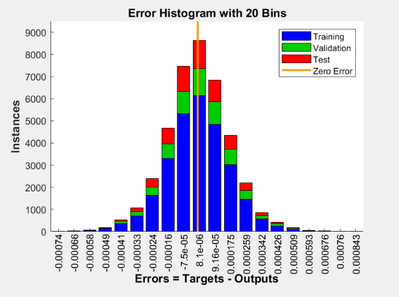
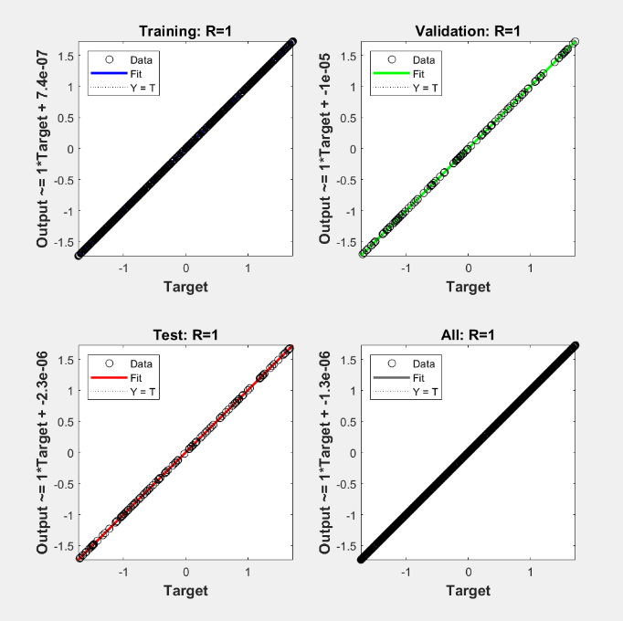

# Research-Project

This project aims to develop a neural network model to predict the refractive index of radar waves based on wave propagation and incidence angle. By leveraging deep learning, the goal is to improve the accuracy and reliability of radar systems by modeling how radar waves interact with atmospheric conditions, enabling better real-time performance analysis.

## Current Progress
I have successfully generated synthetic data to simulate radar wave propagation under varying atmospheric conditions, incorporating factors like temperature inversions and humidity gradients. I have implemented a neural network model to predict the refractive index based on this data, achieving an R² score close to 1.00, indicating excellent accuracy.

Currently, I am fine-tuning the model and optimizing it for real-world radar data. The next steps involve testing on real-world conditions and further enhancing its performance for practical applications.

### Code
For this project, I used MATLAB to generate synthetic data and develop a neural network model to predict the refractive index. The data was designed to capture realistic atmospheric patterns, ensuring a diverse range of features for robust model training. This approach allows for accurate simulation of real-world conditions while maintaining full control over data properties.

The code for this project is available in the following repository:

Feel free to explore, contribute, or provide feedback. The code is organized into different modules based on data preprocessing, model training, and evaluation.

### Figures

I utilized multiple figures to illustrate how well the neural network model fits the actual values in the dataset. The error histogram and performance metrics show a strong alignment between predicted and actual values, highlighting the model’s ability to accurately capture complex atmospheric relationships.

  

<em>Figure 1: This shows the plot from my neural network model, demonstrating minimal error against the targets.</em>

  

  

<em>Figure 1: This shows the plot from my fine tree regressor model, demonstrating an almost perfect fit.</em>

When compared to the Support Vector Machine (SVM) Regressor, the Fine Tree Regressor consistently demonstrated superior performance. While the SVM regressor struggled with overfitting and underfitting in certain regions—especially where the data exhibited complex, non-linear patterns—the fine tree model maintained high accuracy across all data ranges. This is largely due to the fine tree's inherent flexibility in partitioning the feature space, allowing it to adapt more effectively to subtle variations in the data.

Overall, the visual comparisons and performance metrics clearly establish the Fine Tree Regressor as the more effective model for this dataset, offering both precision and reliability in its predictions.

## Challenges
* Adapting the models to handle noisy or incomplete real-world data.
* Fine-tuning hyperparameters for optimal performance.
* Handling the complexity of atmospheric effects in real radar data.

## Next Steps
* Integrate real-world radar data when available.
* Fine-tune models based on the new data.
* Conduct further validation to improve model robustness and reliability.
* Explore the use of other machine learning models and techniques to enhance predictions.
